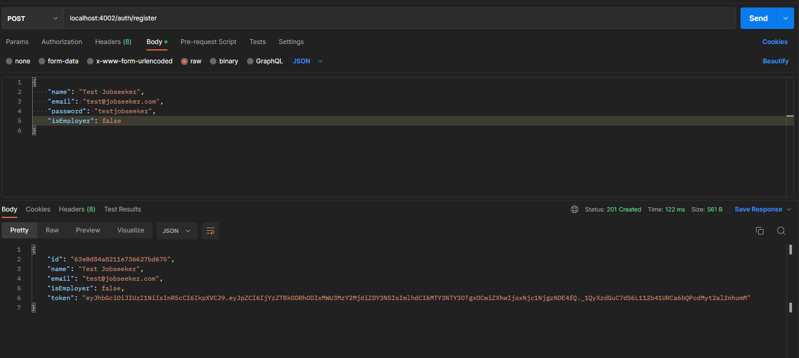
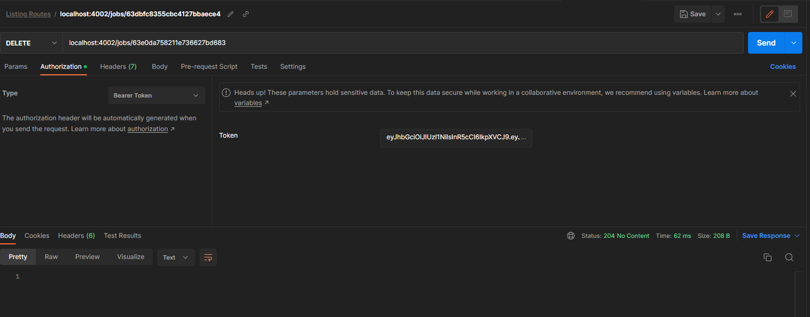

# T3A2-B Full Stack App - Steve's Jobs

## By [Anthony Huynh](https://github.com/antohuynh), [Matthew Ng](https://github.com/matthewngc) & [Timothy Nguyen](https://github.com/timmywebdev)
---

Steve's Jobs is a job seeking platform designed for Jobseekers and Employers. A user can sign up as an Employer and post job listings while a Jobseeker can look at those listings and apply to them.

Steve's Jobs is a MERN stack application and is deployed on Railway and Netlify.

#

## Links

---

Deployed Application: [https://t3a2-b-client-production.up.railway.app/](https://t3a2-b-client-production.up.railway.app/)

Deployed Backend: [https://t3a2-b-server-production-2fb3.up.railway.app/](https://t3a2-b-server-production-2fb3.up.railway.app/)

Server Repo: [https://github.com/matthewngc/T3A2-B-Server](https://github.com/matthewngc/T3A2-B-Server)

Client Repo: [https://github.com/matthewngc/T3A2-B-Client](https://github.com/matthewngc/T3A2-B-Client)

Part A Documentation: [https://github.com/antohuynh/AnthonyHuynh_T3A2-A](https://github.com/antohuynh/AnthonyHuynh_T3A2-A)

#

## Installation Instructions

---
Frontend:
1. Clone this repository by running the following command in terminal:

    ```git clone https://github.com/matthewngc/T3A2-A-Client```
2. Movie into the directory and run ```npm install``` to install dependencies
3. Run the site using ```npm run dev```

Backend:

1. Clone this repository by running the following command in terminal:

    ```git clone https://github.com/matthewngc/T3A2-B-Server```
2. Move into the directory and run ```npm install``` to install dependencies
3. Create a .env file and copy the envionmental variables from the .env.sample file
4. Create a database in MongoDB Atlas and copy the database connection string
5. Paste the database connection string in the .env file for ATLAS_DB_URL
6. Set any string as the JWT_SECRET_KEY in the .env file
7. Run the server using ```nodemon```
8. Seed the database by running ```node seed.js```

Once both the frontend and backend are running, paste the link given for the frontend server into your browser and the website should be running.

#


## Testing
---
Thorough testing was conducted across multiple platforms, including Chrome and Firefox browsers on both Windows and MacOS operating systems, as well as on a variety of mobile devices and screen sizes. Automated testing was implemented using both Vitest and Jest, while manual testing was performed through the use of Postman and by executing the application both locally and through deployment.

Manual Testing During Development, Staging and Production:

| Test Case | Test Scenario | Steps | Expected Result | Pass/Fail |
| --- | --- | --- | --- | --- |
| 1 | Verify that the home page loads correctly | 1. Open the application in a web browser. <br> 2. Visit the homepage URL. | 1. The home page should load successfully without any errors. <br> 2. The page should display the expected components and content, such as the header, footer, and search bar. | Pass |
| 2 | Verify that the job listings page opens correctly | 1. Open the application in a web browser. <br> 2. Visit the homepage URL. <br> 3. Press button to view jobs | 1. The job listings page should load successfully without any errors. <br> 2. The page should display a list of job postings including the job title, company name, and location. | Pass |
| 3 | Verify that the job posting details page displays correctly | 1. Open the application in a web browser. <br> 2. Visit the homepage URL. <br> 3. Go to job listings <br> 4. Click on a job post to view its details. | 1. The job posting details page should load successfully without any errors. <br> 2. The page should display the job title, company name, location, and description. <br> 3. The page should also display a button that allows the user to apply for the job. | Pass |
| 4 | Verify that the job application process works correctly | 1. Open the application in a web browser. <br> 2. Visit the homepage URL. <br> 3. Log in as a jobseeker. <br> 4. Click on a job posting to view its details. <br> 5. Click the "Apply" button. | 1. The job application should go through and it should appear on the jobseeker dashboard | Pass |
| 5 | Verify that creating a joblisting as an employer works correctly | 1. Open the application in a web browser. <br> 2. Visit the homepage URL. <br> 3. Log in as an employer. <br> 4. Click on a 'Create a Listing' <br> 5. Fill in the relevant details and submit | 1. The job listing should be created and it can be viewed on the joblisting page and a list in the employer dashboard | Pass |

Front-end automated testing: [https://github.com/matthewngc/T3A2-B-Client/tree/main/src/components/tests](https://github.com/matthewngc/T3A2-B-Client/tree/main/src/components/tests)

Back-end automated testing: [https://github.com/matthewngc/T3A2-B-Server/tree/main/tests](https://github.com/matthewngc/T3A2-B-Server/tree/main/tests)

Postman: 

    Login as Employer:

    
    Login as Jobseeker:

    
    Get all jobs:

    
    Get one job:

    
    Register as jobseeker:

    
    Register as employer:

    
    Post application:

    
    Post joblisting:

    
    Update joblisting:

    
    Delete application:

    
    Delete joblisting:

    
    Get applications (Employer):

    
    Get applications (Jobseeker):

    
    Get joblistings (Employer):

    
    Edit application:


#

## Trello

[Link to Trello Workspace](https://trello.com/invite/b/pT8OVgb1/ATTI374649f9e9ea48f327111d9b527bdbba33BB8CDB/t3a2-full-stack-app)

At the end of each day, we took a screenshot of the Trello board

    Day 1:


    Day 2:


    Day 3:


    Day 4:

